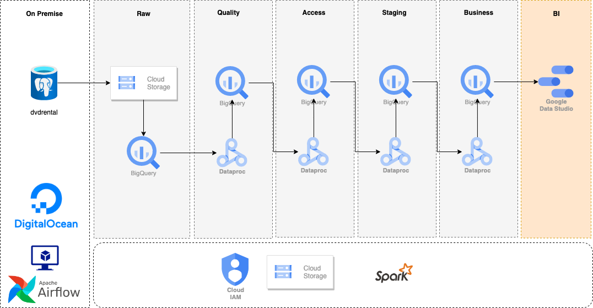

# Airflow with Docker

## Steps

Before following the next steps, make sure you have docker and docker-compose and you are in the folder where lies `Dockerfile` and `docker-compose.yml`

1. Create a `.env` file following the `.env.sample`
    - `AIRFLOW_UID`: User ID that is running the docker commands
    - `AIRFLOW_GID`: Group ID of the user
    - `_AIRFLOW_WWW_USER_USERNAME`: Username for airflow webserver. You can erase it and `airflow` will be the default username
    - `_AIRFLOW_WWW_USER_PASSWORD`: Same as above but for password
1. Build the image with `docker image build -t extending_airflow .`
1. `docker-compose up airflow-init` or `docker compose` depending on your docker version
1. After initialization is complete, you should see a message like this: `start_airflow-init_1 exited with code 0`
1. `docker-compose up -d`
1. Check with `docker ps` that you have the DB, scheduler  and webserver running.

# final project dag

It uses a DB running on Digital Ocean (dvdrental) which is a [PostgreSQL sample database](https://www.postgresqltutorial.com/postgresql-getting-started/postgresql-sample-database/).

The following schema will give you more details about how the pipeline works.

All scripts executed in dataproc are in the `pyspark` folder.

# Articles
- [Run Airflow with Docker](https://airflow.apache.org/docs/apache-airflow/stable/howto/docker-compose/index.html)
- [Bsed on coder2j](https://github.com/coder2j/airflow-docker)